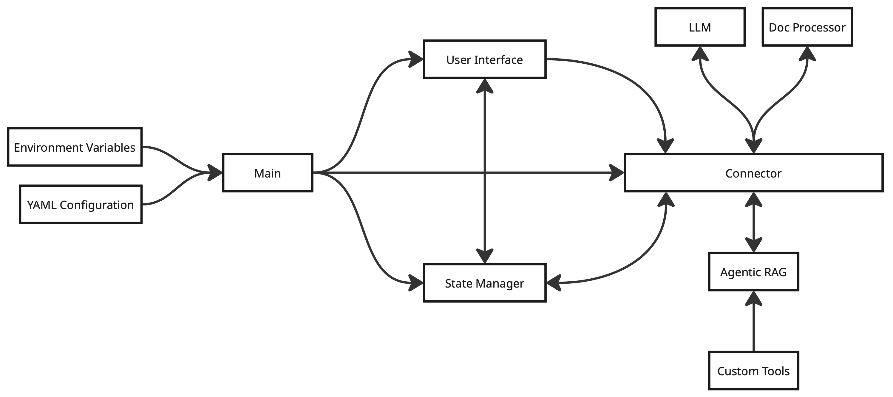

# Reading Assistant

A personal reading assistant powered by RAG (Retrieval-Augmented Generation) technology. Upload your PDF documents and interact with them using your preferred language model—OpenAI GPT or local Ollama models. Supports multi-file Q&A, persistent vector storage, and more.

<div style="text-align: center; margin: 20px 0;">
  
</div>

## Features

- **Multi-Model Support:**
  - Use OpenAI GPT models (via API key)
  - Use local Ollama models (e.g., llama3, tinyllama) via LiteLLMModel
- **Multi-File Upload:**
  - Upload and process multiple PDF documents in one session
  - Ask questions across all uploaded documents
- **Persistent Vector Database:**
  - Uses ChromaDB to store document vectors
  - No need to re-upload or re-embed the same file—vectors are reused
- **Agentic RAG Q&A:**
  - Retrieval-augmented generation with agentic reasoning (SmolAgents)
  - Web search fallback (DuckDuckGo) for broader answers
- **Modern UI:**
  - Gradio web interface with drag-and-drop multi-file upload
  - Real-time status, error reporting, and character count
- **Configurable & Secure:**
  - All settings via `.env` and `conf/configurations.yml`
  - Supports custom embedding models (HuggingFace, etc.)

<br>

> Screenshots <br>
> At [assets/imgs](https://github.com/alishhde/ReadingAssistant/tree/main/assets/imgs) you can check some example of Q/A in this app.


## Prerequisites

- Python 3.11 or higher
- UV package manager installed ([Install UV](https://github.com/astral-sh/uv))
- Ollama installed and running for local models ([Ollama docs](https://ollama.com/))

## Quick Start

1. **Install UV** (if not already installed):

   ```bash
   curl -LsSf https://astral.sh/uv/install.sh | sh
   ```

2. **Configure Environment Variables**:
   - Copy `.env.example` to `.env`:

     ```bash
     cp .env.example .env
     ```

   - Edit `.env` to select your model and set required variables:

       ```bash
       # Model Type Selection: "openai" or "ollama"
       MODEL_TYPE=openai

       # If using OpenAI:
       OPENAI_API_KEY=your_openai_api_key_here

       # If using Ollama:
       LOCAL_MODEL_NAME=your_local_model_name_here  # e.g. llama3, tinyllama

       # Embedding model for document processing (HuggingFace or similar)
       EMBEDDING_MODEL=sentence-transformers/all-MiniLM-L6-v2

       # Server configuration
       SERVER_NAME=127.0.0.1
       SERVER_PORT=7860

       # Other configurations
       CONFIG_PATH=conf/configurations.yml
       AGENT_MODEL_LOADER=true
       AGENT_MAX_STEP=10
       CHROMA_PATH=vectorbase/
       ```

   - **Model Configuration File:**
     - The file `conf/configurations.yml` contains detailed model settings (model name, temperature, max tokens, Ollama URL, etc.).
     - Example:
       ```yaml
       OPENAI_CONFIG:
           model_name: gpt-3.5-turbo
           temperature: 0.7
           max_tokens: 512
       Ollama_CONFIG:
           model_name: ollama/tinyllama:latest
           url: http://127.0.0.1:11434
       ```
     - You can edit this file to change model parameters without touching the code.

3. **Run the Application**:

   ```bash
   uv run main.py
   ```

   UV will automatically:
   - Create a virtual environment
   - Install all required dependencies
   - Load environment variables
   - Start the application

4. **Access the Application**:
   - Open your web browser
   - Navigate to `http://127.0.0.1:7860` (or your configured server address)

## Usage Tips

- **Uploading Files:**
  - You can upload multiple PDF files at once. The system will process and index all of them for Q&A.
  - If you upload a file that was already processed, it will be skipped (no duplicate vectorization).
- **Asking Questions:**
  - Enter your question in the UI. The agent will search across all uploaded documents and use web search if needed.
- **Switching Models:**
  - Change `MODEL_TYPE` in your `.env` to switch between OpenAI and Ollama.
  - Adjust model parameters in `conf/configurations.yml` as needed.
- **Persistence:**
  - All document vectors are stored in the ChromaDB database (`CHROMA_PATH`). You do not need to re-upload files between sessions.

## Notes
The application uses your environment variables and configuration file to set up the model and connection settings. Make sure all required API keys and tokens are properly configured in your `.env` and `conf/configurations.yml` before running the application.
>
> **Ollama**<br>
If you want to use the ollama model consider the following notes:
> - You must have [Ollama](https://ollama.com/) installed and running on your machine to use local models.
> - You must **download the Ollama model** you want to use (e.g., `ollama pull tinyllama:latest`).
> - To get the exact model name, run `ollama list` in your terminal. Get the precise name (e.g., `tinyllama:latest`).
> - When configuring the model in `conf/configurations.yml`, **prefix the model name with `ollama/`** (e.g., `ollama/tinyllama:latest`).
> - The default Ollama URL is usually `http://127.0.0.1:11434`, but if you have connection issues, make sure your model is available at the correct URL on your machine.
> - Keep in mind that, since this is an agentic RAG system, the context becomes more important than usual. Therefore, you have to choose those local models that support longer sequences of context.
